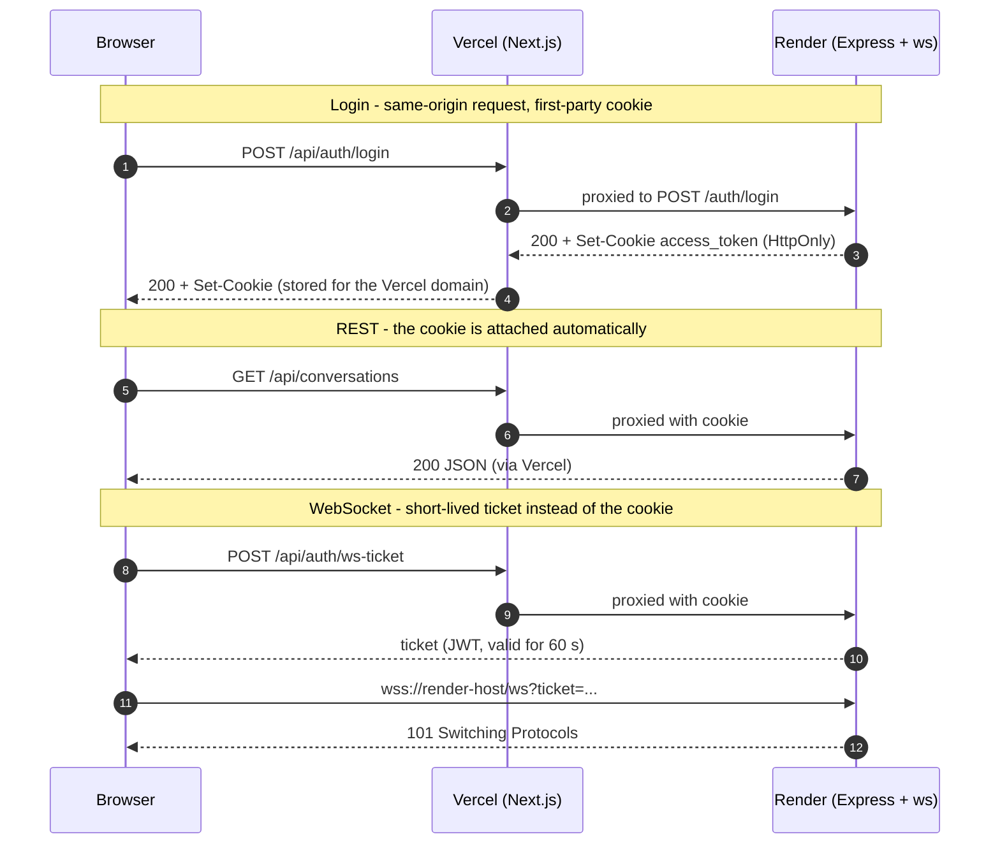

# Chatter — Real-Time Chat Application

[](https://chatter-app-io.vercel.app)
[](https://nextjs.org/)
[](https://react.dev/)
[](https://tailwindcss.com/)
[](https://www.typescriptlang.org/)
[](https://www.postgresql.org/)

**Chatter** is a modern, responsive full-stack real-time messaging application designed with mobile-first principles, clean Feature-Sliced Design (FSD) architecture, and instant WebSocket synchronization.

🔗 **Live Demo:** [chatter-app-io.vercel.app](https://chatter-app-io.vercel.app)

---

> [!IMPORTANT]
> ### ⚠️ Note on Initial Load & Free Tier Database
> The database and backend server may run on free-tier hosting infrastructure that spins down after inactivity.
> **The very first page load can take up to 1 minute** while the backend and database instance wake up from sleep mode. Once connected, all real-time events, messaging, and presence updates operate with instant latency.

---

## 🌟 Features

- **Real-Time Messaging:** Fast, bidirectional communication powered by WebSockets (`ws`).
- **Live User Presence:** Instant `online` / `offline` status indicators in the chat header.
- **Mobile-First Responsive Layout:**
  - Clean view switching between conversations list and active chat with native slide transitions, plus drawer navigation.
  - Side-by-side conversation list and chat window with slide-out sidebar drawer.
  - Three-column layout displaying the floating pill sidebar, conversation list, and chat window simultaneously.
- **Long-Term Session Persistence:** Secure authentication with JWT stored in HTTP-only cookies, lasting **30 days** without premature logouts.
- **Protected Routes & Redirection:** Unauthorized users are automatically redirected to the login page; logged-in users cannot access auth forms.
- **Conversation Previews:** The conversation list displays a snippet of the latest message and human-readable timestamps (`12:45`, `Yesterday`, `Mon`, or `Sep 30`).
- **Smooth Auto-Hiding Scrollbars:** Custom scrollbars themed to match the app palette that auto-fade 1 second after scrolling stops.
- **User Discovery:** Real-time search to discover other registered users and start private conversations.

---

## 🛠️ Tech Stack

### Client
- **Framework:** [Next.js 16](https://nextjs.org/) (App Router) + [React 19](https://react.dev/)
- **Styling:** [Tailwind CSS v4](https://tailwindcss.com/)
- **Icons:** [Lucide React](https://lucide.dev/)
- **State Management:** [Zustand](https://zustand-demo.pmnd.rs/)
- **Architecture:** Feature-Sliced Design (FSD)

### Server
- **Runtime:** [Node.js](https://nodejs.org/) with [Express 5](https://expressjs.com/)
- **Language:** TypeScript
- **Real-Time Protocol:** WebSockets ([ws](https://github.com/websockets/ws))
- **Database:** [PostgreSQL](https://www.postgresql.org/) (`pg` connection pool)
- **Security:** [jsonwebtoken](https://github.com/auth0/node-jsonwebtoken) (JWT) + [bcrypt](https://github.com/kelektiv/node.bcrypt.js) password hashing

---

## 🔐 Authentication Architecture

The client (Vercel), the API (Render) and the database (Neon) are hosted on different domains. That setup breaks naive cookie auth in two ways, and this project is designed around both.

### The two problems

1. **Third-party cookies are blocked.** If the browser calls the API on `onrender.com` while the user is on `vercel.app`, the auth cookie is a *cross-site* cookie. Safari / iOS and Chrome Incognito block those by default: login "succeeds", the cookie is dropped, and every following request returns `401`.
2. **WebSockets cannot go through the proxy.** Vercel rewrites are plain HTTP proxying and cannot carry a WebSocket connection, so the browser has to connect to the API host directly. A cookie that belongs to the Vercel domain is not sent there.

### The solution

- **Same-origin API proxy.** The browser only ever talks to the Vercel domain. Next.js `rewrites` forward `/api/*` to the backend ([`client/next.config.ts`](client/next.config.ts)), so the auth cookie is a first-party cookie and works everywhere.
- **Short-lived WebSocket tickets.** Before connecting, the client asks `POST /api/auth/ws-ticket` (authenticated by the cookie) for a ticket, then opens `wss://<api-host>/ws?ticket=...`. The server verifies the ticket during the HTTP upgrade and rejects the connection with `401` if it is missing, invalid or expired.



### Tokens

| Token | Stored in | Lifetime | Purpose |
| --- | --- | --- | --- |
| Access token (JWT) | `HttpOnly` cookie `access_token` | 30 days | Authenticates REST requests |
| WebSocket ticket (JWT, `type: "websocket"`) | URL query `?ticket=` | 60 seconds | Authenticates one WebSocket upgrade |

The client fetches a fresh ticket for every (re)connection and reconnects automatically with exponential backoff (up to 15 s) and a 25 s heartbeat.

### Security measures

- Passwords hashed with **bcrypt** (cost 12); login failures return one generic `Invalid credentials` message.
- Access token lives in an **`HttpOnly`** cookie, so it is not readable from JavaScript (`Secure` + `SameSite=None` in production).
- Every conversation and message operation checks that the user is a **participant** (`403` / `404` otherwise) — in REST handlers and in WebSocket `join` / `send` events.
- WebSocket payloads are limited to **64 KB** and validated at runtime.
- Required secrets are checked at startup, so the server fails fast on missing configuration.

### Rate limiting

| Endpoint | Limit | Counted per |
| --- | --- | --- |
| `POST /auth/login` | 10 **failed** attempts / 15 min (successful logins are not counted) | IP + username |
| `POST /auth/register` | 20 requests / hour | IP |

Exceeding a limit returns `429 Too Many Requests` with a `Retry-After` header.

Behind reverse proxies (Vercel → Render) the server only sees the proxy's address unless it is told how many proxies to trust. Set `TRUST_PROXY` to the number of addresses in the `X-Forwarded-For` header of a request that reaches the server (for example `203.0.113.7, 76.76.21.21` → `2`). Counters are kept in memory, so they reset on restart and work for a single server instance.

For known gaps and next steps see the [Roadmap](#-roadmap--known-limitations).

---

## 📁 Repository Structure

```text
chatter/
├── client/                               # Next.js frontend application (Feature-Sliced Design)
│   ├── src/
│   │   ├── app/                          # App Router: routes, pages, global styles, and providers
│   │   ├── widgets/                      # Composite UI: large, self-contained layout blocks (Sidebar, ChatWindow)
│   │   ├── features/                     # User actions: business-value capabilities (auth, send-message, search)
│   │   ├── entities/                     # Business entities: core domain logic and internal state (user, message)
│   │   └── shared/                       # Reusable primitives: abstract UI components, API clients, and utilities
│   ├── .env.example                      # Client environment variables template
│   ├── next.config.ts                    # Next.js configuration + /api proxy to the backend
│   ├── package.json                      # Frontend dependencies & scripts
│   └── tsconfig.json                     # Frontend TypeScript configuration
│
├── server/                               # Express + WebSocket backend (Layered & Repository Architecture)
│   ├── .env.example                      # Server environment variables template
│   ├── database/                         # SQL schema (schema.sql)
│   ├── src/
│   │   ├── auth/                         # Authentication layer (JWT, secure cookies, and route protection)
│   │   ├── config/                       # Application configuration and environment variables
│   │   ├── infrastructure/               # Low-level infrastructure (PostgreSQL database pool & WebSocket server)
│   │   ├── modules/                      # Domain-driven modules encapsulated with Services & Repositories (users, messages)
│   │   ├── types/                        # Custom TypeScript declarations and Express type extensions
│   │   ├── app.ts                        # Express application setup, middlewares, and routing pipeline
│   │   └── index.ts                      # Server entrypoint initializing HTTP and WebSocket runtimes
│   ├── package.json                      # Backend dependencies & scripts
│   └── tsconfig.json                     # Backend TypeScript configuration
│
├── biome.json                            # Biome toolchain configuration (Linter & Formatter)
├── package.json                          # Monorepo root workspace configuration and unified scripts
└── README.md                             # Project overview and main documentation

```

---

## 🚀 Getting Started

### Prerequisites

- **Node.js** 20.x or higher
- **npm** 10.x or higher
- **PostgreSQL** instance (local or hosted e.g. Neon, Supabase, Railway)

### 1. Clone the repository

```bash
git clone https://github.com/Nazarii-Lesniak/chatter.git
cd chatter
```

### 2. Install dependencies

Install dependencies for all workspaces from the project root:

```bash
npm install
```

### 3. Environment Configuration

Copy the example files and adjust the values:

```bash
cp server/.env.example server/.env
cp client/.env.example client/.env.local
```

#### Server (`server/.env`)

| Variable | Required | Default | Description |
| --- | --- | --- | --- |
| `JWT_SECRET` | ✅ | — | Secret used to sign JWTs. Generate one with `node -e "console.log(require('crypto').randomBytes(48).toString('hex'))"` |
| `DATABASE_URL` | ✅ | — | PostgreSQL connection string |
| `PORT` | | `3001` | Port of the HTTP/WebSocket server |
| `CLIENT_ORIGIN` | | `http://localhost:3000` | Allowed CORS origin |
| `TRUST_PROXY` | | `0` | Number of reverse proxies in front of the server (see [Rate limiting](#rate-limiting)) |
| `NODE_ENV` | | — | Set to `production` when deployed: enables `Secure` + `SameSite=None` cookies and SSL for the database connection |

#### Client (`client/.env.local`)

| Variable | Required | Default | Description |
| --- | --- | --- | --- |
| `NEXT_PUBLIC_API_URL` | ✅ in production builds | `http://localhost:3001` (dev only) | Backend origin. Next.js proxies `/api/*` to it and the WebSocket connects to it directly |

> [!NOTE]
> `NEXT_PUBLIC_*` values are inlined at **build time**. After changing the variable on Vercel, redeploy (ideally without the build cache). A production build without it fails on purpose instead of silently pointing at `localhost`.

---

### 4. Set Up the Database

The schema lives in [`server/database/schema.sql`](server/database/schema.sql). It creates four tables (`users`, `conversations`, `conversation_participants`, `messages`) and three indexes. Every statement uses `IF NOT EXISTS`, so the file is safe to run more than once.

#### Option A — Neon (hosted PostgreSQL)

1. Create a project at [neon.tech](https://neon.tech) (or add Neon from the **Storage** tab of your Vercel project).
2. Copy the connection string (**Dashboard → Connect**) into `DATABASE_URL`.
3. Open the **SQL Editor**, paste the whole content of `schema.sql` and press **Run**.
   Running the statements one by one works as well — just keep the order, because tables with foreign keys must be created after the tables they reference.

#### Option B — Local PostgreSQL

```bash
createdb chatter
psql chatter -f server/database/schema.sql
```

Then set `DATABASE_URL=postgresql://<user>:<password>@localhost:5432/chatter`.

To verify the setup, `psql "$DATABASE_URL" -c "\dt"` should list the four tables.

---

### 5. Running the Development Servers

Run client and server in two terminals from the project root:

#### Terminal 1 — Backend
```bash
npm run dev:server
```
*Server starts at `http://localhost:3001` with the WebSocket endpoint `ws://localhost:3001/ws`.*

#### Terminal 2 — Frontend
```bash
npm run dev:client
```
*Client starts at `http://localhost:3000`. Requests to `/api/*` are proxied to `NEXT_PUBLIC_API_URL` (your local server).*

Open [http://localhost:3000](http://localhost:3000) and register your first user.

---

### 6. Building for Production

To validate and build both projects:

```bash
# Build server
npm run build:server

# Build client
npm run build:client
```

---

## ☁️ Deployment

| Part | Platform | Notes |
| --- | --- | --- |
| Client | [Vercel](https://vercel.com) | Project root: `client/` |
| Server | [Render](https://render.com) | Web service running the Express + WebSocket server |
| Database | [Neon](https://neon.tech) | Serverless PostgreSQL — apply `schema.sql` once ([guide](#4-set-up-the-database)) |

**Vercel** — `NEXT_PUBLIC_API_URL=https://<your-service>.onrender.com`, enabled for **Production, Preview and Development**.

**Render** — `DATABASE_URL`, `JWT_SECRET`, `CLIENT_ORIGIN` (your Vercel URL), `NODE_ENV=production` and `TRUST_PROXY` (see [Rate limiting](#rate-limiting)).

---

## 🗺️ Roadmap & Known Limitations

- [ ] Schema validation of REST payloads with Zod, and forms with React Hook Form
- [ ] One-time WebSocket tickets (currently a ticket can be reused during its 60 s lifetime)
- [ ] Refresh tokens and server-side session revocation (logout currently only clears the cookie)
- [ ] `SameSite=Lax` cookie, now that all browser traffic is same-origin
- [ ] Message pagination (the full history of a conversation is loaded at once)
- [ ] Automated tests and CI

---
